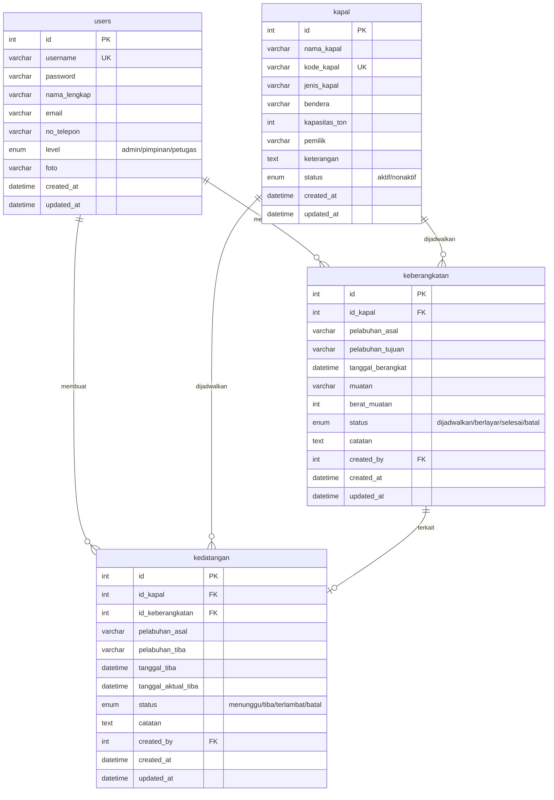
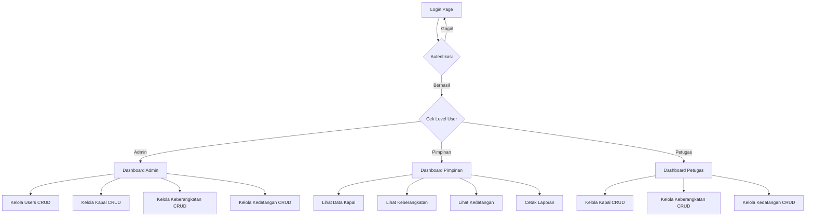

# ITL Shipping Agency - Aplikasi Jadwal Kapal

Aplikasi web PHP untuk PT. ITL Shipping Agency yang mengelola jadwal keberangkatan dan kedatangan kapal, data kapal, serta manajemen pengguna dengan 3 level akses (Admin, Pimpinan, Petugas).

---

## Database Schema (MySQL)

### Entity Relationship Diagram



### Relasi Antar Tabel

| Relasi | Keterangan |
|---|---|
| `keberangkatan.id_kapal` → `kapal.id` | Setiap keberangkatan terkait satu kapal |
| `kedatangan.id_kapal` → `kapal.id` | Setiap kedatangan terkait satu kapal |
| `kedatangan.id_keberangkatan` → `keberangkatan.id` | Kedatangan bisa terkait keberangkatan |
| `keberangkatan.created_by` → `users.id` | Siapa yang membuat jadwal keberangkatan |
| `kedatangan.created_by` → `users.id` | Siapa yang membuat jadwal kedatangan |

---

## Alur Aplikasi (Flow)



### Hak Akses Per Level

| Fitur | Admin | Pimpinan | Petugas |
|---|:---:|:---:|:---:|
| Dashboard + Statistik | ✅ | ✅ | ✅ |
| Kelola Users (CRUD) | ✅ | ❌ | ❌ |
| Kelola Kapal (CRUD) | ✅ | 👁️ Lihat | ✅ |
| Kelola Keberangkatan (CRUD) | ✅ | 👁️ Lihat | ✅ |
| Kelola Kedatangan (CRUD) | ✅ | 👁️ Lihat | ✅ |
| Cetak/Lihat Laporan | ✅ | ✅ | ❌ |

---

## Proposed Changes

### Folder Structure

```
app_shipping/
├── config/
│   └── database.php          # Koneksi database PDO
├── includes/
│   ├── auth.php               # Session & authorization helper
│   ├── header.php             # HTML head + navbar
│   ├── sidebar.php            # Sidebar navigation
│   └── footer.php             # Footer + scripts
├── assets/
│   ├── css/
│   │   └── style.css          # Custom CSS (premium maritime theme)
│   ├── js/
│   │   └── app.js             # Custom JavaScript
│   └── img/
│       └── logo.png           # Logo ITL
├── login.php                  # Halaman login
├── logout.php                 # Proses logout
├── index.php                  # Dashboard (redirect by role)
├── users/
│   ├── index.php              # List users
│   ├── create.php             # Form tambah user
│   ├── edit.php               # Form edit user
│   └── delete.php             # Proses hapus user
├── kapal/
│   ├── index.php              # List kapal
│   ├── create.php             # Form tambah kapal
│   ├── edit.php               # Form edit kapal
│   └── delete.php             # Proses hapus kapal
├── keberangkatan/
│   ├── index.php              # List keberangkatan
│   ├── create.php             # Form tambah jadwal berangkat
│   ├── edit.php               # Form edit jadwal berangkat
│   └── delete.php             # Proses hapus jadwal berangkat
├── kedatangan/
│   ├── index.php              # List kedatangan
│   ├── create.php             # Form tambah jadwal tiba
│   ├── edit.php               # Form edit jadwal tiba
│   └── delete.php             # Proses hapus jadwal tiba
├── laporan/
│   └── index.php              # Laporan keberangkatan & kedatangan
└── database.sql               # SQL untuk setup database
```

### Technology Stack

| Komponen | Teknologi |
|---|---|
| Backend | PHP 7+ (Native/Procedural with PDO) |
| Database | MySQL via XAMPP |
| Frontend | Bootstrap 5 + Custom CSS |
| Icons | Bootstrap Icons |
| DataTable | DataTables.js |
| Charts | Chart.js (dashboard) |

---

### Database Setup

#### [NEW] [database.sql](file:///c:/xampp/htdocs/app_shipping/database.sql)
- CREATE DATABASE `db_itl_shipping`
- CREATE TABLE `users`, `kapal`, `keberangkatan`, `kedatangan`
- INSERT default admin user (admin/admin123)
- Foreign key constraints

---

### Config & Includes

#### [NEW] [database.php](file:///c:/xampp/htdocs/app_shipping/config/database.php)
- PDO connection to `db_itl_shipping`

#### [NEW] [auth.php](file:///c:/xampp/htdocs/app_shipping/includes/auth.php)
- `checkLogin()` - redirect ke login jika belum login
- `checkRole($allowed_roles)` - cek hak akses level
- `isAdmin()`, `isPimpinan()`, `isPetugas()` helper functions

#### [NEW] [header.php](file:///c:/xampp/htdocs/app_shipping/includes/header.php)
- HTML head, navbar with user info & logout button
- Bootstrap 5 CDN, DataTables CDN, Chart.js CDN

#### [NEW] [sidebar.php](file:///c:/xampp/htdocs/app_shipping/includes/sidebar.php)
- Sidebar navigasi dinamis berdasarkan level user
- Menu: Dashboard, Users (Admin), Kapal, Keberangkatan, Kedatangan, Laporan

#### [NEW] [footer.php](file:///c:/xampp/htdocs/app_shipping/includes/footer.php)
- JavaScript files, closing tags

---

### Assets

#### [NEW] [style.css](file:///c:/xampp/htdocs/app_shipping/assets/css/style.css)
- Premium maritime-themed design: navy blue (#0a1628), teal accents (#0891b2), gold highlights (#f59e0b)
- Glassmorphism sidebar, smooth transitions, card hover effects
- Responsive design

#### [NEW] [app.js](file:///c:/xampp/htdocs/app_shipping/assets/js/app.js)
- DataTables initialization, SweetAlert2 confirmations, sidebar toggle

---

### Authentication

#### [NEW] [login.php](file:///c:/xampp/htdocs/app_shipping/login.php)
- Form login (username + password)
- Password verification via `password_verify()`
- Set session variables (id, username, nama, level)

#### [NEW] [logout.php](file:///c:/xampp/htdocs/app_shipping/logout.php)
- Destroy session, redirect ke login

---

### Dashboard

#### [NEW] [index.php](file:///c:/xampp/htdocs/app_shipping/index.php)
- Statistik cards: Total Kapal, Keberangkatan Hari Ini, Kedatangan Hari Ini, Total Users
- Chart.js: Grafik keberangkatan per bulan
- Tabel jadwal terbaru (5 terakhir)

---

### Modul Users (Admin Only)

#### [NEW] [users/index.php](file:///c:/xampp/htdocs/app_shipping/users/index.php) - [users/create.php](file:///c:/xampp/htdocs/app_shipping/users/create.php) - [users/edit.php](file:///c:/xampp/htdocs/app_shipping/users/edit.php) - [users/delete.php](file:///c:/xampp/htdocs/app_shipping/users/delete.php)
- CRUD lengkap dengan DataTables
- Password di-hash dengan `password_hash()`
- Hanya Admin yang bisa mengakses

---

### Modul Kapal

#### [NEW] [kapal/index.php](file:///c:/xampp/htdocs/app_shipping/kapal/index.php) - [kapal/create.php](file:///c:/xampp/htdocs/app_shipping/kapal/create.php) - [kapal/edit.php](file:///c:/xampp/htdocs/app_shipping/kapal/edit.php) - [kapal/delete.php](file:///c:/xampp/htdocs/app_shipping/kapal/delete.php)
- CRUD lengkap: nama, kode, jenis, bendera, kapasitas, pemilik, status
- Admin & Petugas: Full CRUD
- Pimpinan: Read-only

---

### Modul Keberangkatan

#### [NEW] [keberangkatan/index.php](file:///c:/xampp/htdocs/app_shipping/keberangkatan/index.php) - [keberangkatan/create.php](file:///c:/xampp/htdocs/app_shipping/keberangkatan/create.php) - [keberangkatan/edit.php](file:///c:/xampp/htdocs/app_shipping/keberangkatan/edit.php) - [keberangkatan/delete.php](file:///c:/xampp/htdocs/app_shipping/keberangkatan/delete.php)
- Dropdown select kapal (dari tabel kapal)
- Status management: dijadwalkan → berlayar → selesai
- Otomatis catat `created_by` dari session user

---

### Modul Kedatangan

#### [NEW] [kedatangan/index.php](file:///c:/xampp/htdocs/app_shipping/kedatangan/index.php) - [kedatangan/create.php](file:///c:/xampp/htdocs/app_shipping/kedatangan/create.php) - [kedatangan/edit.php](file:///c:/xampp/htdocs/app_shipping/kedatangan/edit.php) - [kedatangan/delete.php](file:///c:/xampp/htdocs/app_shipping/kedatangan/delete.php)
- Bisa dikaitkan ke jadwal keberangkatan
- Tanggal estimasi tiba vs tanggal aktual tiba
- Status: menunggu → tiba / terlambat

---

### Modul Laporan

#### [NEW] [laporan/index.php](file:///c:/xampp/htdocs/app_shipping/laporan/index.php)
- Filter berdasarkan tanggal, kapal, dan status
- Tabel laporan keberangkatan & kedatangan
- Fitur cetak (Print CSS)
- Hanya Admin & Pimpinan

---

## Verification Plan

### Manual Verification (Browser Testing)
1. **Buka** `http://localhost/app_shipping/login.php`
2. **Login** dengan akun default admin (admin / admin123)
3. **Cek Dashboard** - pastikan statistik cards dan chart muncul
4. **Test CRUD Users** - tambah user baru dengan level Petugas dan Pimpinan
5. **Test CRUD Kapal** - tambah, edit, hapus data kapal
6. **Test CRUD Keberangkatan** - jadwalkan keberangkatan dengan memilih kapal
7. **Test CRUD Kedatangan** - catat kedatangan terkait keberangkatan
8. **Test Hak Akses** - login sebagai Pimpinan (hanya bisa lihat) dan Petugas (bisa CRUD tapi tidak bisa kelola user)
9. **Test Laporan** - filter dan cetak laporan
